# anchor-positioning-hover-cards

[Demo](https://trinhvanminh.github.io/anchor-positioning-hover-cards/)

**Trọng tâm của API này là mối quan hệ giữa điểm anchor và các phần tử được định vị.**

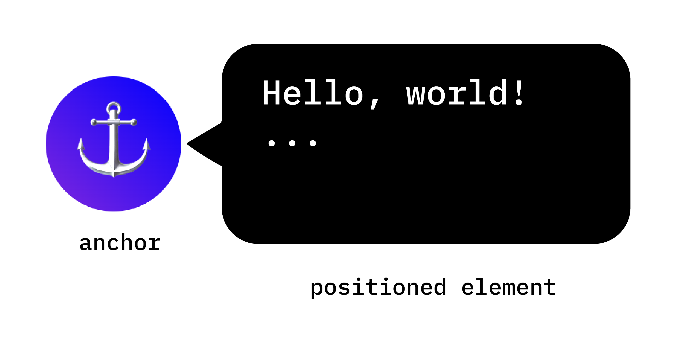

### Thiết lập anchor với anchor-name (như thiết lập css variable)

```css
.anchor-button {
    anchor-name: --anchor-el;
}
```

### Gán element với anchor bằng cách chỉ định position-anchor với anchor-name bên trên

```css
.positioned-notice {
    position-anchor: --anchor-el;
}
```

### Tuỳ chỉnh vị trí của element so với anchor bằng thuộc tính `position` với `anchor(top)`, `anchor(right)` đóng vai trò như vị trí để đặt element.

```css
.positioned-notice {
    position-anchor: --anchor-el;
    /* absolutely position the positioned element */
    position: absolute;
    /* position the right of the positioned element at the right edge of the anchor */
    right: anchor(right);
    /* position the bottom of the positioned element at the top edge of the anchor */
    bottom: anchor(top);
}
```

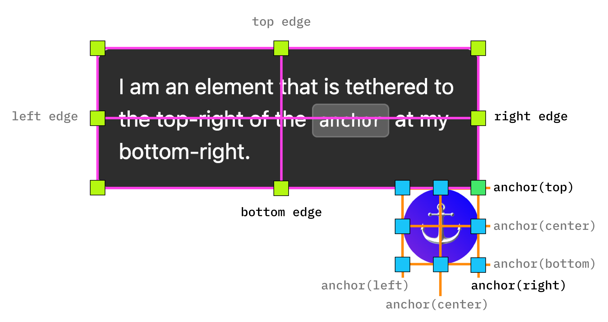

### Để chỉnh element vào giữa so với anchor

- Căn ngang: `justify-self: anchor-center`
- Căn dọc: `algin-self: anchor-center`

```css
.positioned-notice {
  position: absolute;
  /*  Anchor reference  */
  position-anchor: --anchor-el;
  /*  Position bottom of positioned elem at top of anchor  */
  bottom: anchor(top);
  /*  Center justification to the anchor */
  justify-self: anchor-center;
}
```

### [Multiple anchors](https://developer.chrome.com/blog/anchor-positioning-api#multiple_anchors)

### [Position with inset-area](https://developer.chrome.com/blog/anchor-positioning-api#position_with_inset-area)

### [Size elements with `anchor-size()`](https://developer.chrome.com/blog/anchor-positioning-api#size_elements_with_anchor-size)

```css
.positioned-notice {
  position-anchor: --question-mark;

  /* set max height of the tooltip to 2x height of the anchor */
  max-height: calc(anchor-size(height) * 2);
}
```

### [Sử dụng anchor như một popover và dialog](https://developer.chrome.com/blog/anchor-positioning-api#use_anchor_with_top-layer_elements_like_popover_and_dialog)

- `<button popovertarget="my-tooltip-id" />` với thuộc tính popovertarget="my-tooltip-id"
- Element với thuộc tính `id="my-tooltip-3"` và `popover`

### Chỉnh lại anchor position với `@postion-try` (khi element với vị trí cũ bị che khuất thì browser sẽ chuyển qua sử dụng [position-try](https://developer.chrome.com/blog/anchor-positioning-api#adjust_anchor_positions_with_position-try))

### Tự động position-try với position-try-options (sử dụng built-in browser supported flip keywords)

```css
position-try-options: flip-block, flip-inline, flip-block flip-inline;
```

```css
#my-tooltip {
  position-anchor: --question-mark;
  inset-area: top;
  position-try-options: flip-block;
}
```

### Tuỳ chỉnh điều kiện để hiện thị tooltip element [position-visibility](https://developer.chrome.com/blog/anchor-positioning-api#position-visibility_for_anchors_in_subscrollers)

> anchor scroll out of the view thì tooltip sẽ không hiển thị nữa fixedpos tooltip + position-visibility: anchors-visible. (phải sử dụng fake anchor - xem chi tiết ở link)

```css
#tooltip {
  position: fixed;
  position-anchor: --anchor-top-anchor;
  position-visibility: anchors-visible;
  bottom: anchor(top);
}
```

> Alternatively, you use `position-visibility: no-overflow` to prevent the anchor from overflowing its container.

### About polyfilling @supports

```css
@supports (anchor-name: --myanchor) {
  /* Anchor styles here */
}
```

### Accessibility with aria-details attribute

```html
<div class="anchor" aria-details="sidebar-comment">Main content</div>
<div class="positioned" id="sidebar-comment">Sidebar content</div>
```

Not nerd enough for you, see the spec: https://drafts.csswg.org/css-anchor-position-1

# CSS explaination

### linear-gradient

- medium: https://patrickbrosset.medium.com/do-you-really-understand-css-linear-gradients-631d9a895caf
- playground: https://codepen.io/captainbrosset/pen/ByqRMB
- mdn: https://developer.mozilla.org/en-US/docs/Web/CSS/gradient/linear-gradient

```css
div {
  background-image: linear-gradient(var(--bg) 0 2px, transparent 2px 38px);
}
```

#### Linear gradient angle

- angle
  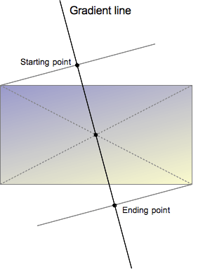
  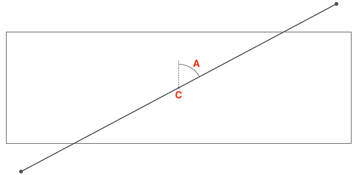

- if the angle is omitted, it defaults to to bottom (which is 180deg or 0.5turn):
  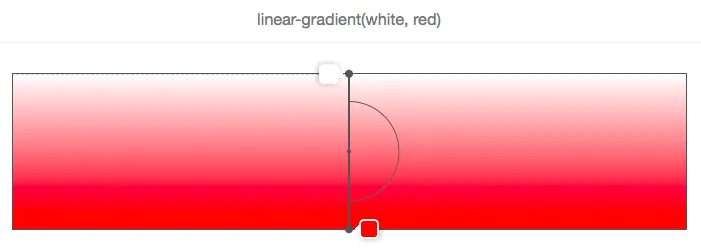

- Demonstrate
  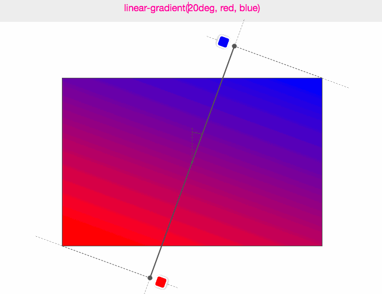

#### Gradient line length

- color stops

  `<color> [<percentage> | <length>]?`

  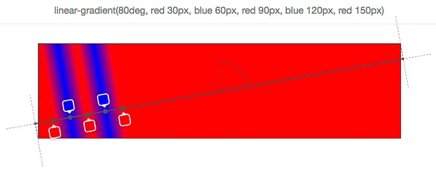

  > Using these positions, you can come up with all sorts of nice effects. One thing you can do for instance is use a gradient to not draw a gradient at all, but have multiple colors:

  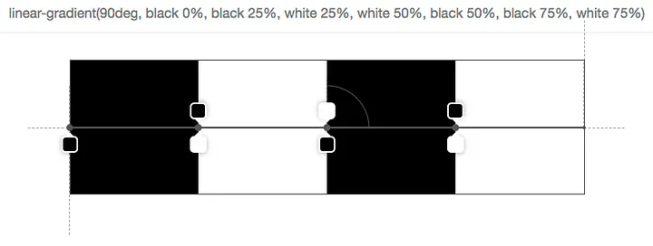

  _Shorthand_: `linear-gradient(90deg, black 0% 25%, white 25% 50%, black 50% 75%, white 75%)`

- [Test it](https://codepen.io/captainbrosset/pen/ByqRMB)

### background

- mdn: https://developer.mozilla.org/en-US/docs/Web/CSS/background

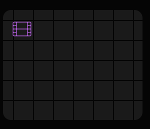

```css
div {
  /* create a horizontal line to 180deg from 0px to 2px and spaces between two line from 2px to 38px and then similar to vertical line to 90deg */
  background-image: linear-gradient(black 0 2px, transparent 2px 38px),
    linear-gradient(90deg, black 0 2px, transparent 2px 38px);
  /* x y => adjust position of "song sắt" to make it look center */
  background-position: -20px -20px, -20px -20px;
  /* width height => adjust dimension of background each line and spaces and then repeat with background-repeat: repeat (default) */
  background-size: 40px 40px, 40px 40px;
}
```

- Shorthand properties: https://developer.mozilla.org/en-US/docs/Web/CSS/Shorthand_properties

```css
div {
  background: linear-gradient(black 0 2px, transparent 2px 38px) -20px -20px /
      40px 40px, linear-gradient(
        90deg,
        black 0 2px,
        transparent 2px 38px
      ) -20px -20px / 40px 40px;
}
```

### mask

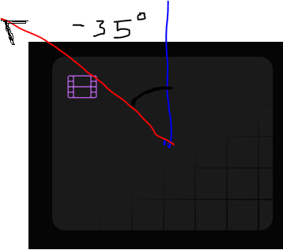

```css
div {
  mask: linear-gradient(-35deg, black 0%, transparent 45%);
}
```

- **Linear-gradient**: Hướng góc `-35deg` tô màu `black` từ `starting point` 0% tới 45% và sau đó là màu transparent (xem linear gradient angle bên trên)

- **mask**: hiển thị theo màu (linear-gradient) hoặc theo shape của mask (img) do đó nó sẽ hiển thị phần có màu đen
  > the alpha channel of the mask image will be multiplied with the alpha channel of the element. This can be controlled with the [mask-mode](https://developer.mozilla.org/en-US/docs/Web/CSS/mask-mode) property.

### Liên quan

[background size, background position](./more-about-background.html)
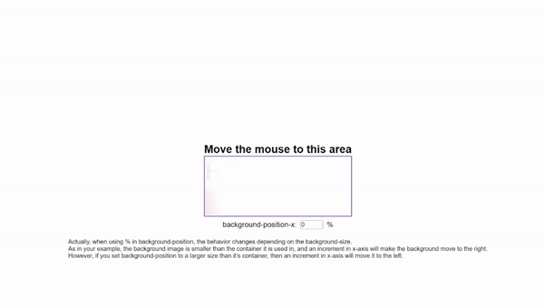
